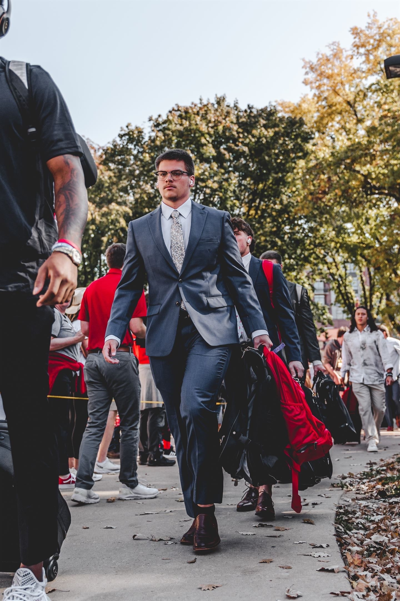
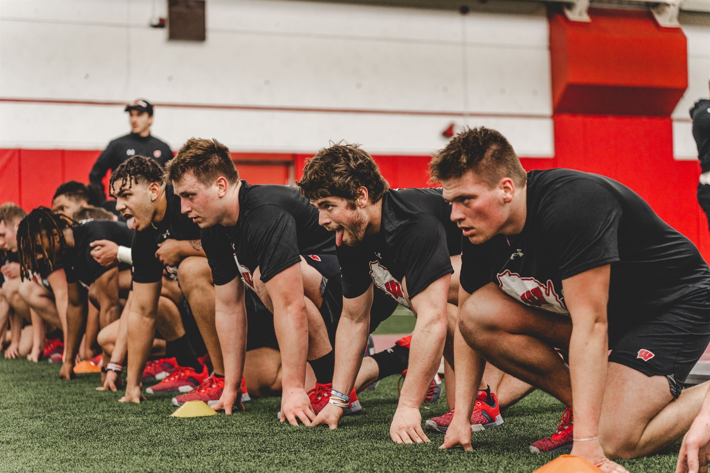

# GavinLahm.github.io
<!DOCTYPE html>
<html lang="en">
<meta charset="UTF-8"> 
<head>
<link rel="stylesheet" type="text/css" href="style.css">
<title>Gavin Lahm</title>

		<!--- Information you don't want to display to users --> 

</head>

	<body style="background-color: #FAE39A;">
		<!--- Enter code below this comment. Remember all code you want to display to users needs to be between the <body> tags --> 
			<h1 style="color: #E03019;">Gavin Lahm</h1>
			<h2></h2>
			
<i>About me</i>

			
 I am a current freshman here at UW-Madison. I am one of four children in my family. I am from a small town just south of Green Bay, Wisconsin called Kaukauna. I am studying Personnal Finance with a certificate in Business. 

			<ul> 
			<li> <a href="https://www.instagram.com/gavin.lahm/?next=%2F">Visit my Instagram</a></li>
			<li> <a href="file:///C:/Users/gavin_vjx9587/Downloads/family%20html.html">Family</a></li>
			<li> <a href="file:///C:/Users/gavin_vjx9587/Downloads/accomplishments%20html.html">Accomplishments</a></li>
			<li> <a href="file:///C:/Users/gavin_vjx9587/Downloads/hobbies.html">Hobbies</a></li>
			</ul>
			
	</body>

</html>
